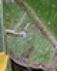
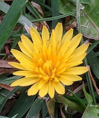
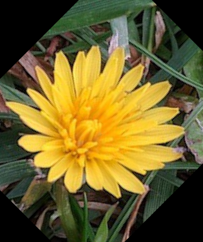
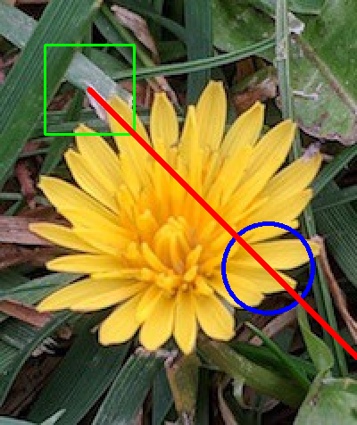
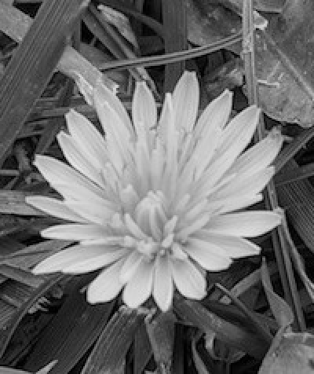
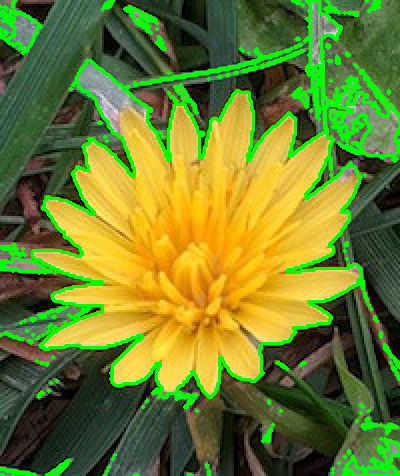
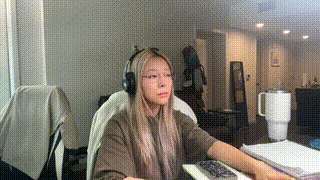

# Mini Project 2

This is the Mini Project 2 repository. It contains various scripts and resources related to computer vision and image processing.

## Files
- `CamTest.py`: Script for capturing and processing webcam input.
- `flower.py`: Script for image manipulation on a sample flower image.
- `output.mp4`: Sample output video from the webcam.

## Examples
1. `flower.py`
1)Show Region of Interest (ROI):(startY=60, endY=160, startX=320, endX=420).

2) Resize Image: Adjust the image size to (200, 200) while maintaining the aspect ratio.

3) Rotate Image: Rotate the image 45 degrees clockwise.

4) Smooth Image: Apply GaussianBlur for smoothing.

5) Drawing: Draw one rectangle, one circle, and one line on the image.

6) Add Text: Insert the text onto the image.

7) Convert to Grayscale: Change the image to grayscale.

8) Edge Detection: Use the Canny method for edge detection.

9) Thresholding: Apply a threshold to the image.

10) Detect and Draw Contours: Identify and outline the contours in the image.

2. `CamTest.py`
 - This script captures video frames from a webcam and applies various effects in real-time, including cropping, resizing, blurring, drawing shapes, adding text, edge detection, and a custom cartoon effect. Users can toggle each effect on or off using specific key presses.
   
   - It also supports recording the processed video output to an `output.mp4` file. The cartoon effect, when triggered, applies a series of transformations to give the video a "cartoonish" look.
   

## How to Use
1. Run `CamTest.py` to start capturing video from your webcam.
2. Use the functions in `flower.py` to apply different image processing techniques.

## Requirements
- Python 3.x
- OpenCV
- NumPy
