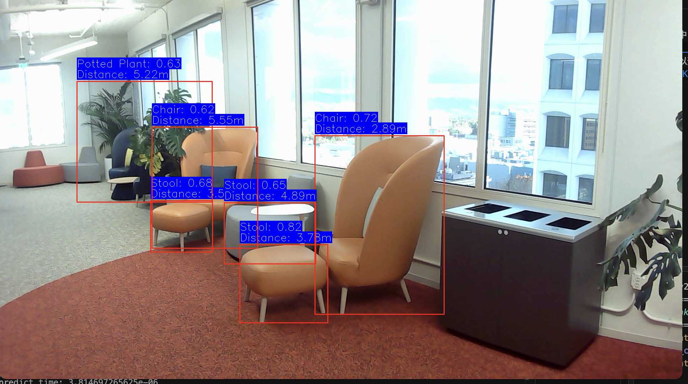
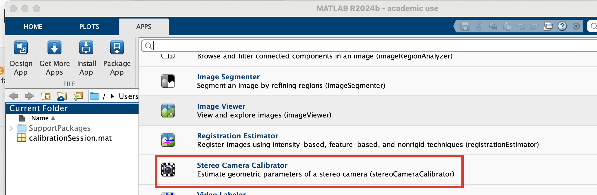
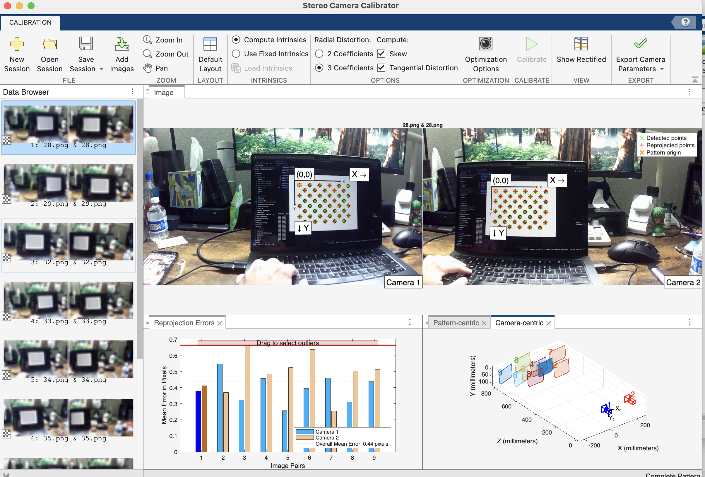
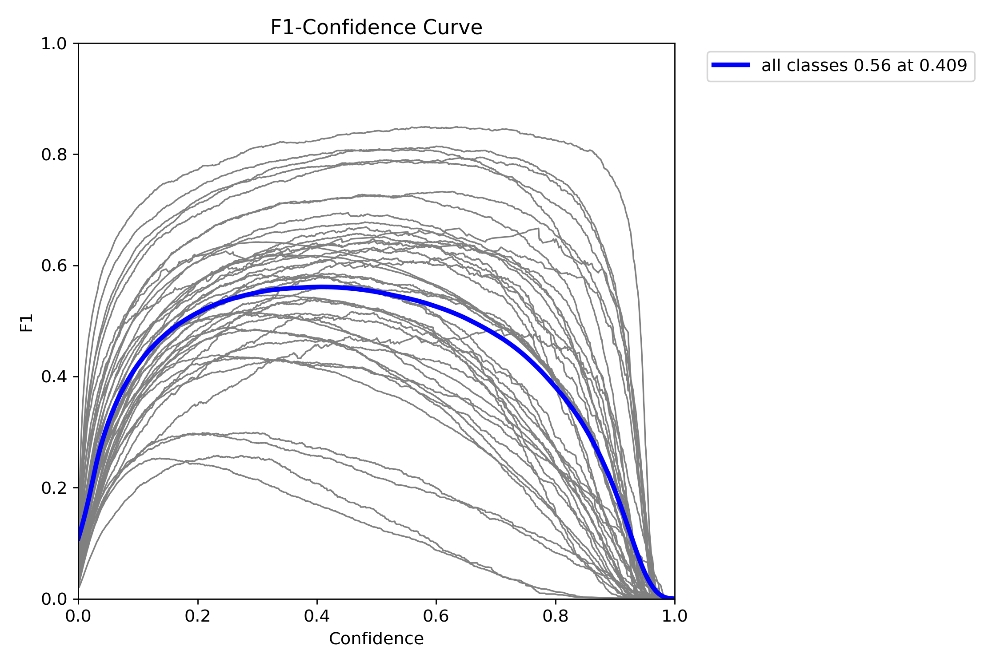
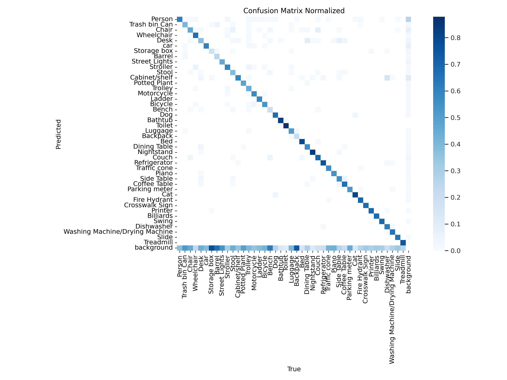
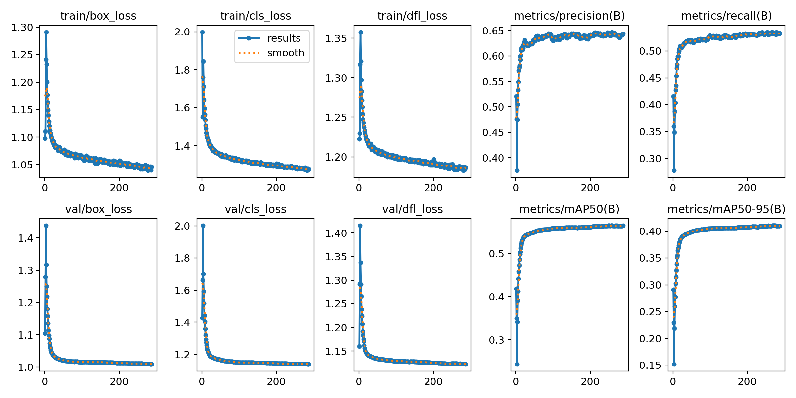

# Descriptive Vision Assistance Device-Group5


A real-time obstacle avoidance system using AI and computer vision technology to assist visually impaired individuals in navigating their environment safely.

## Table of Contents
- [Team Members](#team-members)
- [Overview](#overview)
- [Requirements](#requirements)
- [Installation](#installation)
- [Usage](#usage)
- [Dataset](#dataset)
  
  
  
## Team Members
- Tongle Yao
- Xuedong Pan
- Yufei Huang
- Siyi Gao

## Overview

This project aims to develop an obstacle detection system to assist visually impaired individuals in navigating their environment. Leveraging YOLO v11 neural network technology, the system achieves precise obstacle detection and, in combination with a stereo camera setup, enables accurate distance measurement of the target obstacles. Additionally, the system employs TTS (Text-to-Speech) technology to provide real-time audio notifications about obstacle information, promptly alerting users to avoid potential hazards. This AI-driven system, integrated with stereo cameras and voice alerts, enhances traditional white cane usage by offering visually impaired individuals more efficient, detailed, and comprehensive environmental awareness, effectively reducing travel risks.


## Demo Video
You can watch the demo video [here](https://youtu.be/9njp5Nq8DAc)

## Requirements
```
numpy==1.24.4
opencv_python==4.10.0.84
pyttsx3==2.98
PyYAML==6.0.2
torch==2.4.1  # depends on your purpose and cuda version
tqdm==4.67.0
ultralytics==8.3.32
```

## Usage
### Calibration

#### Setup
You need to have two cameras setup on a holder and connect to the computer:


You can find chessboard images in `paperwork/imgs/chessboard.jpg` or you can use your own chessboard images.

Go to `camera/utils/config.py` and change the `CHESSBOARD_SIZE`, `FRAME_SIZE`, `CHESSBOARD_SQUARE_SIZE_MM` to the size of your printed chessboard and camera resolution.

#### Calibration Dual Camera

take calibration photos:

```python
python take_calibrate_photo.py --mode dual --left_cam <camera_index> --right_cam <camera_index> --auto_take_photo True
```
if you want to take photos manually, set `auto_take_photo` to `False` and press `s` to take photo. Press `q` to quit.

run calibration:

```python
python calibrate_cam.py --mode dual
```

Or, I recommend you use Matlab's stereo camera calibrator application to calibrate the cameras. It is more convenient and intuitive to get better calibration results.
 




Make sure you can get a set of images (10-20 images) with different angles and the overall mean error is less than 0.5 pixels and export the results to `stereoParams`.

camera intrinsic matrix: 
```matlab
left_camera_matrix = transpose(stereoParams.CameraParameters1.IntrinsicMatrix)
right_camera_matrix = transpose(stereoParams.CameraParameters2.IntrinsicMatrix)
```

distortion coefficients:
```matlab
left_radial_distortion = stereoParams.CameraParameters1.RadialDistortion;
right_radial_distortion = stereoParams.CameraParameters2.RadialDistortion;
left_tangential_distortion = stereoParams.CameraParameters1.TangentialDistortion;
right_tangential_distortion = stereoParams.CameraParameters2.TangentialDistortion;

left_dist_coeff = [left_radial_distortion(1:2), left_tangential_distortion, left_radial_distortion(3)];
right_dist_coeff = [right_radial_distortion(1:2), right_tangential_distortion, right_radial_distortion(3)];
```

Rotation matrix:
```matlab
R = transpose(stereoParams.RotationOfCamera2);
```

Translation vector:
```matlab
T = stereoParams.TranslationOfCamera2;
```

Then, you can fill in the `left_camera_calibration.json` `right_camera_calibration.json` and `stereo_camera_calibration.json` file with the above parameters.

### Dataset

#### Download dataset and model
You can download the dataset and model from `https://drive.google.com/drive/folders/1iwEXtCdA3jCVms4XGBsisjz3N3ijr75h?usp=sharing`

If you want to train your own model, please put dataset in `datasets/` and modify the `obj365.yaml` file.

Model was trained base on `yolo11s` model and on customized dataset including images and labels from `Cityscapes` and `Object365`.

### Run the program
connect the cameras to the computer and run the program:
```python
python main.py --model <path_to_pt_model>  --label datasets/obj365.yaml --left_cam <camera_index> --right_cam <camera_index> --conf 0.5 --iou 0.5
```
press `v` to speak alert of the distance and category of the nearest obstacle, press `q` to quit.

## File Structure
```
├── camera  # calibration and distance measurement
│   ├── utils
│   │   ├── config.py  # config calibration parameters
│   │   ├── calibration.py  # main function of cameras calibration
│   │   ├── stereo_vision_processing.py  # functions of distance measurement algorithm
│   │   ├── StereoCamera.py  # class reading stereo camera intrinsic and extrinsic parameters
│   ├── calculate_distance.py  # entries of distance measurement
│   ├── take_calibrate_photo.py  # take calibration photos for calibration
├── dataset_processing
│   ├── obj365
│   │   ├── filter_convert_obj365_labels.py  # remove unused label in obj365 and convert to labelme format
|   |   ├── splitObject365Label.py  # split the large Object365 label file into separate files
│   ├── count_bbox_labelme.py  # count the number of bounding boxes for each label in labelme format, help to get the label distribution
│   ├── find_imgs_by_labelme.py  # find the image file path corresponding to the labelme format labels
│   ├── split_dataset.py  # split the dataset into train, val and test sets and balance number of bounding boxes for each class
│   ├── subset_balance_label_bbox.py  # generate a subset of the dataset and balance the number of bounding boxes for each class
│   datasets
│   ├── obj365.yaml  # yolo annotation file
│   frame_processing
│   ├── plot_frame.py  # plot the detected bounding boxes and information on the image
│   ├── post_processing.py  # post processing after model prediction
│   ├── pre_processing.py  # pre processing before model prediction
├── paperwork
│   ├── ...
├── training
│   ├── predict.py  # entries of model prediction
│   ├── train.py  # entries of model training
│   ├── utils.py
├── tts
│   ├── tts.py  # entries of text to speech
├── calibrate_cam.py  # main entry of cameras calibration
├── main.py  # main entry of the obstacle detection system
├── split_dataset.py  # main entry of dataset splitting
├── take_calibrate_photo.py  # main entry of taking calibration photos
```

## Model Evaluation

### Performance on Test Set:
                 Class     Images  Instances      Box(P)         R      mAP50      mAP50-95
                   all      16372     147703      0.648      0.527      0.562      0.408
                Person      10820      52160      0.811      0.535       0.67       0.47
         Trash bin Can       1421       2060      0.547      0.355      0.381      0.275
                 Chair       4640      11830      0.671      0.387       0.48      0.348
            Wheelchair        731       1068      0.736      0.655      0.705      0.477
                  Desk       3837       6233      0.606      0.344      0.419      0.298
                   car       3014      11758      0.755       0.53      0.621      0.431
           Storage box       1835       4374       0.46       0.12      0.169       0.11
                Barrel        666       1445      0.488      0.248      0.267      0.194
         Street Lights       1889       5299      0.673      0.368      0.448       0.27
              Stroller       1386       1629      0.712       0.54      0.623      0.426
                 Stool       1175       1782      0.537      0.352      0.373      0.293
         Cabinet/shelf       4146      10390      0.607      0.519      0.555      0.397
          Potted Plant       1331       2503      0.595      0.374      0.429       0.28
               Trolley        712       1378      0.596      0.414      0.455      0.302
            Motorcycle        332       1477      0.664      0.468       0.54      0.331
                Ladder       1156       1426      0.708      0.569      0.612      0.433
               Bicycle        713       1549      0.681      0.466      0.535      0.337
                 Bench       1355       2299      0.519      0.198      0.231      0.157
                   Dog        559       1445      0.689      0.525      0.599       0.44
               Bathtub        594        617      0.736      0.809      0.819      0.672
                Toilet        874        917      0.834      0.883      0.915      0.826
               Luggage        952       1494      0.582      0.428      0.455      0.289
              Backpack       1115       1641       0.53      0.162      0.186      0.102
                   Bed       1136       1539      0.793      0.732      0.779      0.635
          Dining Table        562       1469      0.515      0.378      0.382      0.251
            Nightstand        770       1444      0.836      0.882      0.896      0.691
                 Couch       1915       3055      0.644      0.702      0.709      0.567
          Refrigerator       1334       1434      0.744      0.728      0.786      0.642
          Traffic cone        318       1488      0.733      0.513      0.569      0.359
                 Piano       1303       1471      0.637      0.457      0.529      0.353
            Side Table       1070       1314      0.554      0.534      0.504      0.378
          Coffee Table       1039       1163      0.596      0.632      0.596      0.492
         Parking meter        288        418      0.616      0.435      0.449      0.309
                   Cat       1164       1432      0.816        0.8      0.844      0.694
          Fire Hydrant       1176       1214      0.841      0.641      0.736      0.511
        Crosswalk Sign        172        220      0.542      0.645      0.583      0.358
               Printer        550        624      0.646      0.657      0.698      0.499
             Billiards        138        484      0.669      0.655      0.653      0.446
                 Swing        450        801      0.677       0.62      0.672      0.473
            Dishwasher        159        159      0.331      0.723      0.547      0.472
        Washing Machine       172        293      0.656      0.696      0.702      0.557
                 Slide        560        793      0.656      0.537      0.585        0.4
             Treadmill         51        114      0.616      0.447      0.444      0.318

### F1 Score:



### Confusion Matrix:



### Training Loss:



## Notes
The program performance, especially the distance measurement accuracy, is highly dependent on camera quality, stand stability, calibration precision and parameter settings. Any error may lead to failure in distance measurement. Files I put in `camera/calibrate_files` are the parameters I got from Matlab stereo camera calibrator application, it is just example files. You need to get the parameters by yourself.

## Challenges in future work
- model prediction take too much time currently, we might consider to use half precision, int8 quantization or smaller input image size to speed up the model.
- Since we aim to deploy this system on edge computing devices like Raspberry Pi, we need to further consider using model formats other than pt, such as tflite or har format supported by hailo TPU.