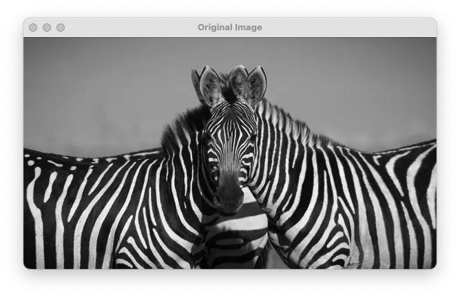

# Lab 7: Thresholding Techniques

## Introduction
This lab explores various thresholding techniques in image processing, focusing on converting grayscale images into binary images. We'll implement and compare different thresholding methods using OpenCV.

## Importance of Thresholding
Thresholding is a fundamental technique in image segmentation that helps in:
- Separating objects from background
- Text extraction from documents
- Creating binary masks for further processing
- Simplifying image analysis

## Types of Thresholding Covered
### Simple Thresholding

- Fixed threshold value for the entire image
- Best for images with uniform lighting
- Most basic form of image segmentation
- Quick to compute but limited in complex scenarios

### Adaptive Thresholding

- Dynamic threshold values based on local regions
- Effective for images with varying lighting conditions
- Considers local neighborhood for each pixel
- Better performance in real-world scenarios

### Otsu's Binarization

- Automatic threshold selection
- Optimal for images with bimodal histograms
- Computationally efficient
- No manual parameter tuning required

## Implementation
Our lab implementation includes the following key components:
1. Loading and preprocessing grayscale images
2. Applying different thresholding techniques
3. Interactive parameter adjustment using trackbars
4. Visual comparison of results
5. Saving processed images

Refer to `thresholding_operations.py` and `lab7.py` for the complete implementation.

## Observations and Explanations

Comparing the different thresholding methods on our test images reveals:

- Simple Thresholding:
  - Works well with clear foreground-background separation
  - Fails in areas with uneven lighting
  - Best suited for controlled environments
  - Fast and computationally efficient

- Adaptive Thresholding:
  - Handles varying lighting conditions effectively
  - Preserves local details better than simple thresholding
  - May create noise in very uniform areas
  - Computationally more intensive than simple thresholding

- Otsu's Method:
  - Performs well on images with distinct peaks in histogram
  - Automatic threshold selection reduces manual tuning
  - May struggle with unimodal or multimodal distributions
  - Balance between speed and effectiveness

## Additional Explorations
1. Experiment with different block sizes in adaptive thresholding
2. Compare performance on various types of images (text, natural scenes, medical images)
3. Combine thresholding with other preprocessing techniques
4. Analyze the effect of noise on different thresholding methods

## Conclusion
This lab demonstrated the strengths and limitations of different thresholding techniques in image processing. Simple thresholding proves effective for basic scenarios with uniform lighting, while adaptive thresholding shows superior performance in handling real-world lighting variations. Otsu's method offers an excellent automated approach for images with clear bimodal intensity distributions.

