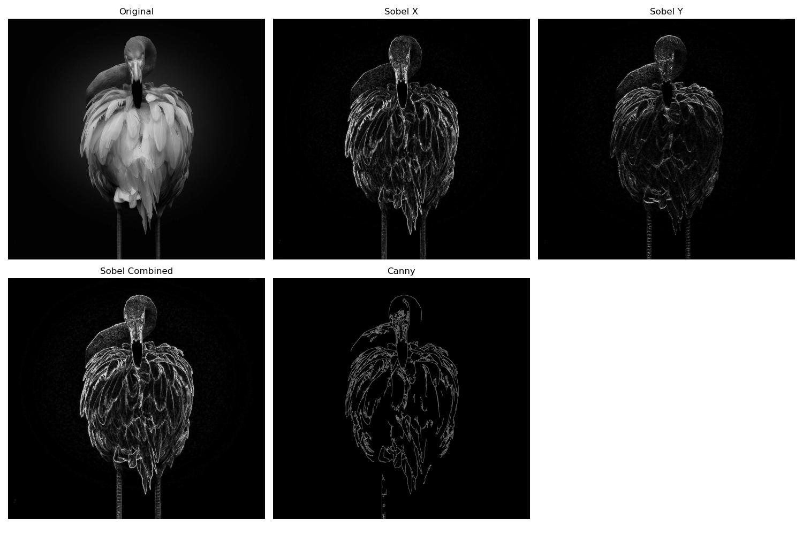

# Lab 8: Edge Detection

## Introduction
This lab explores various edge detection techniques in image processing. Edge detection is crucial for identifying object boundaries and features in images by detecting significant changes in pixel intensity.

## Importance of Edge Detection
Edge detection is fundamental in computer vision for:
- Object Recognition: Helps identify object boundaries and shapes
- Image Segmentation: Assists in separating different regions in images
- Pattern Recognition: Aids in identifying specific patterns and features
- Feature Detection: Crucial for detecting important image features

## Types of Edge Detection Covered

### Sobel Edge Detection

Sobel operator provides both directional (X and Y) edge information:

#### Horizontal Edges (Sobel X)

- Detects vertical changes in intensity
- Highlights horizontal edges
- Uses horizontal gradient kernel

#### Vertical Edges (Sobel Y)

- Detects horizontal changes in intensity
- Highlights vertical edges
- Uses vertical gradient kernel

### Canny Edge Detection

- Multi-step algorithm for robust edge detection
- Includes noise reduction and hysteresis thresholding
- Produces thin, well-defined edges
- More accurate but computationally intensive

## Implementation

Our lab implementation includes:
1. Sobel edge detection for X and Y gradients
2. Combined Sobel edge detection
3. Canny edge detection with adjustable thresholds
4. Interactive parameter tuning
5. Visual comparison of results

Refer to `edge_operations.py` and `lab8.py` for the complete implementation.

## Observations and Explanations
Comparing the original image with different edge detection results:

### Sobel Edge Detection:
- Advantages:
  - Computationally efficient
  - Provides directional information
  - Good for detecting strong edges
- Limitations:
  - Sensitive to noise
  - Produces thicker edges
  - May miss subtle edges

### Canny Edge Detection:
- Advantages:
  - More precise edge detection
  - Better noise handling
  - Produces thin, well-defined edges
- Limitations:
  - Computationally more intensive
  - Requires parameter tuning
  - May produce disconnected edges

## Additional Explorations
1. Experiment with different threshold values in Canny detection
2. Compare edge detection results on various image types:
   - Natural scenes
   - Text documents
   - Medical images
3. Combine edge detection with other preprocessing techniques
4. Study the effect of noise on different edge detection methods

## Conclusion
This lab demonstrates the effectiveness of different edge detection techniques:
- Sobel edge detection proves efficient for basic edge detection needs
- Canny edge detection offers more refined results with better noise handling
- Each method has its strengths and optimal use cases
