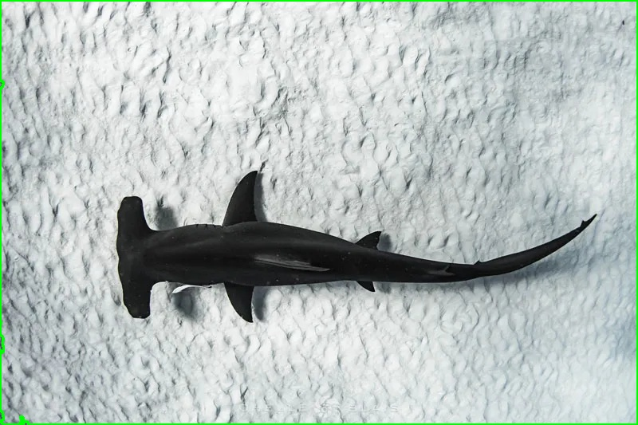
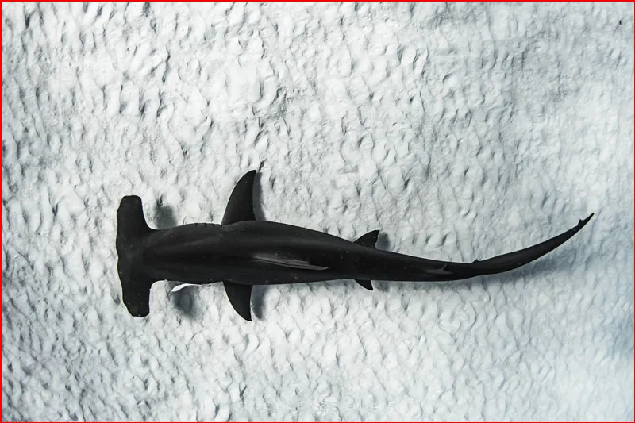
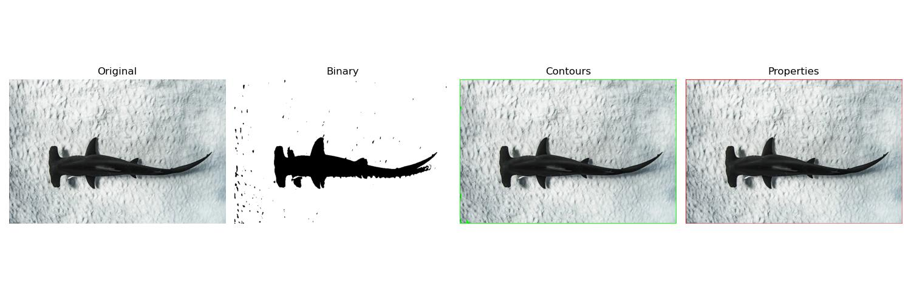

# Lab 9: Contour Detection and Analysis

## Introduction
This lab explores contour detection and analysis in image processing. Contours are continuous curves that follow the boundaries of objects in images, making them crucial for shape analysis and object detection.

## Importance of Contour Detection
Contour detection is fundamental in computer vision for:
- Object Detection: Identifying distinct objects in images
- Object Segmentation: Separating objects from backgrounds
- Shape Analysis: Understanding object morphology
- Feature Extraction: Capturing geometric properties

## Types of Contour Operations Covered

### Binary Image Preprocessing

- Grayscale conversion
- Gaussian blur for noise reduction
- Binary thresholding for clear object separation
- Essential preprocessing for reliable contour detection

### Contour Detection

- External contour retrieval (RETR_EXTERNAL)
- Simple contour approximation (CHAIN_APPROX_SIMPLE)
- Hierarchical structure preservation
- Green contour visualization

### Property Analysis

- Area calculation
- Perimeter measurement
- Aspect ratio computation
- Bounding rectangle visualization

## Implementation
Our lab implementation includes the following key components:
1. Image preprocessing for contour detection
2. Multiple contour retrieval modes
3. Property analysis and measurement
4. Interactive parameter adjustment
5. Comprehensive visualization

Refer to `contour_operations.py` and `lab9.py` for the complete implementation.

## Observations and Explanations

### Original Image Analysis

- Starting point for contour detection
- Shows original object boundaries and features
- Provides baseline for comparison

### Preprocessing Effects:
- Binary conversion improves boundary definition
- Noise reduction enhances contour quality
- Threshold selection impacts contour detection accuracy

### Contour Detection Results:
- External contours capture object boundaries
- Green highlighting shows detected edges
- Contour hierarchy represents object relationships

### Property Analysis:
- Bounding boxes indicate object locations
- Area measurements quantify object size
- Aspect ratios describe shape characteristics

## Additional Explorations
1. Experiment with different contour retrieval modes
2. Test various threshold values for preprocessing
3. Compare simple vs. detailed contour approximation
4. Analyze contours in complex scenes

## Conclusion
This lab demonstrates the power of contour detection and analysis in computer vision:
- Effective object boundary detection
- Accurate shape measurement
- Robust feature extraction
- Quantitative object analysis

